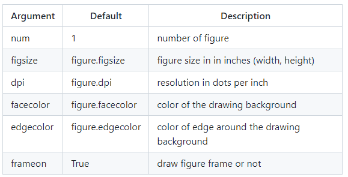
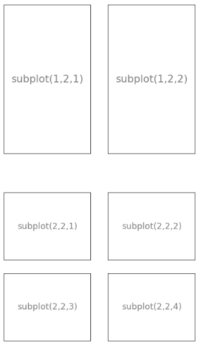
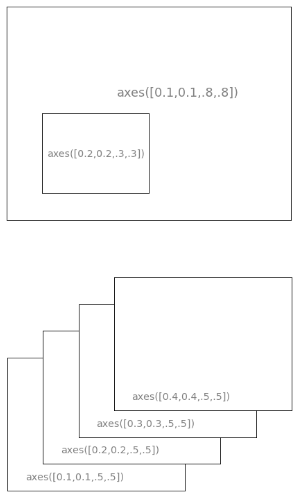

# Data Visualization

## **How to run Linear regression in Python scikit-Learn**:
matplotlib is probably the single most used Python package for 2D-graphics. 

It provides both a very quick way to visualize data from Python and publication-quality figures in many formats. 

We are going to explore matplotlib in interactive mode covering most common cases.

## **Simple plot**
In this section, we want to draw the cosine and sine functions on the same plot. Starting from the default settings, we'll enrich the figure step by step to make it nicer.

The first step is to get the data for the sine and cosine functions:

```py
import numpy as np

X = np.linspace(-np.pi, np.pi, 256, endpoint=True)
C, S = np.cos(X), np.sin(X)
```

**Changing colors and line widths**

```py
plt.figure(figsize=(10,6), dpi=80)
plt.plot(X, C, color="blue", linewidth=2.5, linestyle="-")
plt.plot(X, S, color="red",  linewidth=2.5, linestyle="-")
```
***

**Setting limits**

```py
plt.xlim(X.min()*1.1, X.max()*1.1)
plt.ylim(C.min()*1.1, C.max()*1.1)
```
***

**Setting ticks**

```py
plt.xticks( [-np.pi, -np.pi/2, 0, np.pi/2, np.pi])
plt.yticks([-1, 0, +1])
```
**Adding a legend**

```py
plt.plot(X, C, color="blue", linewidth=2.5, linestyle="-", label="cosine")
plt.plot(X, S, color="red",  linewidth=2.5, linestyle="-", label="sine")

plt.legend(loc='upper left', frameon=False)
```

**Figures, Subplots, Axes and Ticks**

So far we have used implicit figure and axes creation. 

This is handy for fast plots. 

We can have more control over the display using figure, subplot, and axes explicitly. 

A figure in matplotlib means the whole window in the user interface. Within this figure there can be subplots. 

While subplot positions the plots in a regular grid, axes allows free placement within the figure. 

**Figures**

A figure is the windows in the GUI that has "Figure #" as title. Figures are numbered starting from 1 as opposed to the normal Python way starting from 0. This is clearly MATLAB-style. There are several parameters that determine what the figure looks like:



**Subplots**

With subplot you can arrange plots in a regular grid. You need to specify the number of rows and columns and the number of the plot. Note that the gridspec command is a more powerful alternative.



**Axes**

Axes are very similar to subplots but allow placement of plots at any location in the figure. So if we want to put a smaller plot inside a bigger one we do so with axes.


***
**To know more please [visit this page](https://github.com/rougier/matplotlib-tutorial/)**
****

