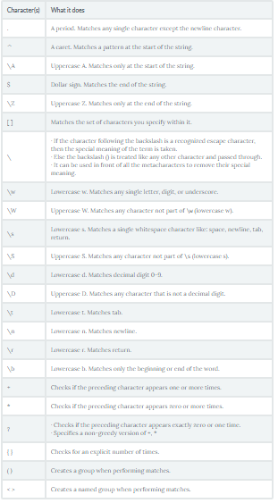

# **Automation**

## **Python Regular Expression Tutorial**
```import re```

The re library in Python provides several functions that make it a skill worth mastering.

**Basic Patterns: Ordinary Characters**

You can easily tackle many basic patterns in Python using ordinary characters. 

Ordinary characters are the simplest regular expressions. 

They match themselves exactly and do not have a special meaning in their regular expression syntax.

Examples are 'A', 'a', 'X', '5'.

Ordinary characters can be used to perform simple exact matches:
```
pattern = r"Cookie"
sequence = "Cookie"
if re.match(pattern, sequence):
    print("Match!")
else: print("Not a match!")
```

```
Match!
```

**Wild Card Characters: Special Characters**

Special characters are characters that do not match themselves as seen but have a special meaning when used in a regular expression. 

For simple understanding, they can be thought of as reserved metacharacters that denote something else and not what they look like.

```
re.search(r'Co.k.e', 'Cookie').group()
```

```
'Cookie'
```
**Summary table**



***
**To know more please [visit this page](https://www.datacamp.com/community/tutorials/python-regular-expression-tutorial)**
***


## **shutil**

**shutil — High-level File Operations**

Purpose:	High-level file operations.

The shutil module includes high-level file operations such as copying and archiving.

**Copying Files**

copyfile() copies the contents of the source to the destination and raises IOError if it does not have permission to write to the destination file.

```py
import glob
import shutil

print('BEFORE:', glob.glob('shutil_copyfile.*'))

shutil.copyfile('shutil_copyfile.py', 'shutil_copyfile.py.copy')

print('AFTER:', glob.glob('shutil_copyfile.*'))
```
```
BEFORE: ['shutil_copyfile.py']
AFTER: ['shutil_copyfile.py', 'shutil_copyfile.py.copy']
```

**Copying File Metadata**

By default when a new file is created under Unix, it receives permissions based on the umask of the current user. To copy the permissions from one file to another, use copymode().

```py
import os
import shutil
import subprocess

with open('file_to_change.txt', 'wt') as f:
    f.write('content')
os.chmod('file_to_change.txt', 0o444)

print('BEFORE:', oct(os.stat('file_to_change.txt').st_mode))

shutil.copymode('shutil_copymode.py', 'file_to_change.txt')

print('AFTER :', oct(os.stat('file_to_change.txt').st_mode))
```
This example script creates a file to be modified, then uses copymode() to duplicate the permissions of the script to the example file.

```
BEFORE: 0o100444
AFTER : 0o100644
```


***
**To know more please [visit this page](https://pymotw.com/3/shutil/)**


***
