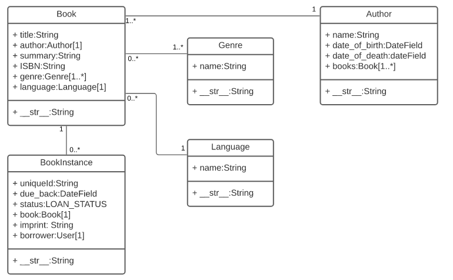

# **Django Models**

Django web applications access and manage data through Python objects referred to as models. Models define the structure of stored data, including the field types and possibly also their maximum size, default values, selection list options, help text for documentation, label text for forms, etc. The definition of the model is independent of the underlying database — you can choose one of several as part of your project settings. Once you've chosen what database you want to use, you don't need to talk to it directly at all — you just write your model structure and other code, and Django handles all the dirty work of communicating with the database for you.

## **Designing the LocalLibrary models**

We know that we need to store information about books (title, summary, author, written language, category, ISBN) and that we might have multiple copies available (with globally unique id, availability status, etc.). 

We might need to store more information about the author than just their name, and there might be multiple authors with the same or similar names. We want to be able to sort information based on book title, author, written language, and category.

When designing your models it makes sense to have separate models for every "object" (a group of related information). In this case, the obvious objects are books, book instances, and authors.

You might also want to use models to represent selection-list options (e.g. like a drop down list of choices), rather than hard coding the choices into the website itself — this is recommended when all the options aren't known up front or may change. 

Obvious candidates for models, in this case, include the book genre (e.g. Science Fiction, French Poetry, etc.) and language (English, French, Japanese).

Once we've decided on our models and field, we need to think about the relationships. 

Django allows you to define relationships that are one to one (OneToOneField), one to many (ForeignKey) and many to many (ManyToManyField).



## **Model definition**


Models are usually defined in an application's models.py file. They are implemented as subclasses of django.db.models.Model, and can include fields, methods and metadata. The code fragment below shows a "typical" model, named MyModelName:

```py
from django.db import models

class MyModelName(models.Model):
    """A typical class defining a model, derived from the Model class."""

    # Fields
    my_field_name = models.CharField(max_length=20, help_text='Enter field documentation')
    ...

    # Metadata
    class Meta:
        ordering = ['-my_field_name']

    # Methods
    def get_absolute_url(self):
        """Returns the url to access a particular instance of MyModelName."""
        return reverse('model-detail-view', args=[str(self.id)])

    def __str__(self):
        """String for representing the MyModelName object (in Admin site etc.)."""
        return self.my_field_name
```
## **Fields**


A model can have an arbitrary number of fields, of any type — each one represents a column of data that we want to store in one of our database tables. Each database record (row) will consist of one of each field value. Let's look at the example seen below:

```py
my_field_name = models.CharField(max_length=20, help_text='Enter field documentation')
```

### **Common field types**

The following list of the more commonly used types of fields.

**CharField**

**TextField** 

**IntegerField** 

**DateField and DateTimeField**

**EmailField** 

**FileField and ImageField** 

**AutoField** 

**ForeignKey** 

**ManyToManyField**

***

**To know more please [visit this page](https://developer.mozilla.org/en-US/docs/Learn/Server-side/Django/Models)**

***

## **Django admin site**

The Django admin application can use your models to automatically build a site area that you can use to create, view, update, and delete records. This can save you a lot of time during development, making it very easy to test your models and get a feel for whether you have the right data. The admin application can also be useful for managing data in production, depending on the type of website. The Django project recommends it only for internal data management (i.e. just for use by admins, or people internal to your organization), as the model-centric approach is not necessarily the best possible interface for all users, and exposes a lot of unnecessary detail about the models.

## **Registering models**


First, open admin.py in the catalog application (/locallibrary/catalog/admin.py). It currently looks like this — note that it already imports django.contrib.admin:

```py
from django.contrib import admin

# Register your models here.
```

Register the models by copying the following text into the bottom of the file. This code imports the models and then calls admin.site.register to register each of them.

```py
from .models import Author, Genre, Book, BookInstance

admin.site.register(Book)
admin.site.register(Author)
admin.site.register(Genre)
admin.site.register(BookInstance)
```

***

**To know more please [visit this page](https://developer.mozilla.org/en-US/docs/Learn/Server-side/Django/Admin_site)**

***
