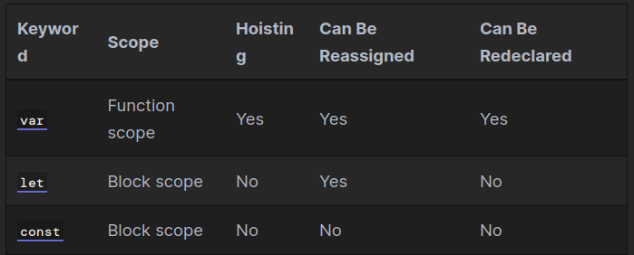

# **React**

## **ES6 Syntax and Feature Overview**

ECMAScript 2015, also known as ES6, introduced many changes to JavaScript. Here is an overview of some of the most common features and syntactical differences, with comparisons to ES5 where applicable.

### **Variables and constant feature comparison**




### **Variable declaration**

ES6 introduced the `let` keyword, which allows for block-scoped variables which cannot be hoisted or redeclared.
```JS
let x = 0
```

### **Constant declaration**

ES6 introduced the const keyword, which cannot be redeclared or reassigned, but is not immutable.

```JS
const CONST_IDENTIFIER = 0 // constants are uppercase by convention
```

### **Arrow functions**

The arrow function expression syntax is a shorter way of creating a function expression. Arrow functions do not have their own this, do not have prototypes, cannot be used for constructors, and should not be used as object methods.

```JS
let func = (a) => {} // parentheses optional with one parameter
let func = (a, b, c) => {} // parentheses required with multiple parameters
```

***

**To know more please [visit this page](https://www.taniarascia.com/es6-syntax-and-feature-overview/)**

***
## **React**

React is a JavaScript library for building user interfaces. Learn what React is all about on our homepage or in the tutorial.

### **Introducing JSX**

Consider this variable declaration:

```JS
const element = <h1>Hello, world!</h1>;
```
This funny tag syntax is neither a string nor HTML.

It is called JSX, and it is a syntax extension to JavaScript. We recommend using it with React to describe what the UI should look like. JSX may remind you of a template language, but it comes with the full power of JavaScript.

JSX produces React “elements”. We will explore rendering them to the DOM in the next section. Below, you can find the basics of JSX necessary to get you started.

**Why JSX?**

React embraces the fact that rendering logic is inherently coupled with other UI logic: how events are handled, how the state changes over time, and how the data is prepared for display.


***

**To know more please [visit this page](https://reactjs.org/docs/hello-world.html)**

***
